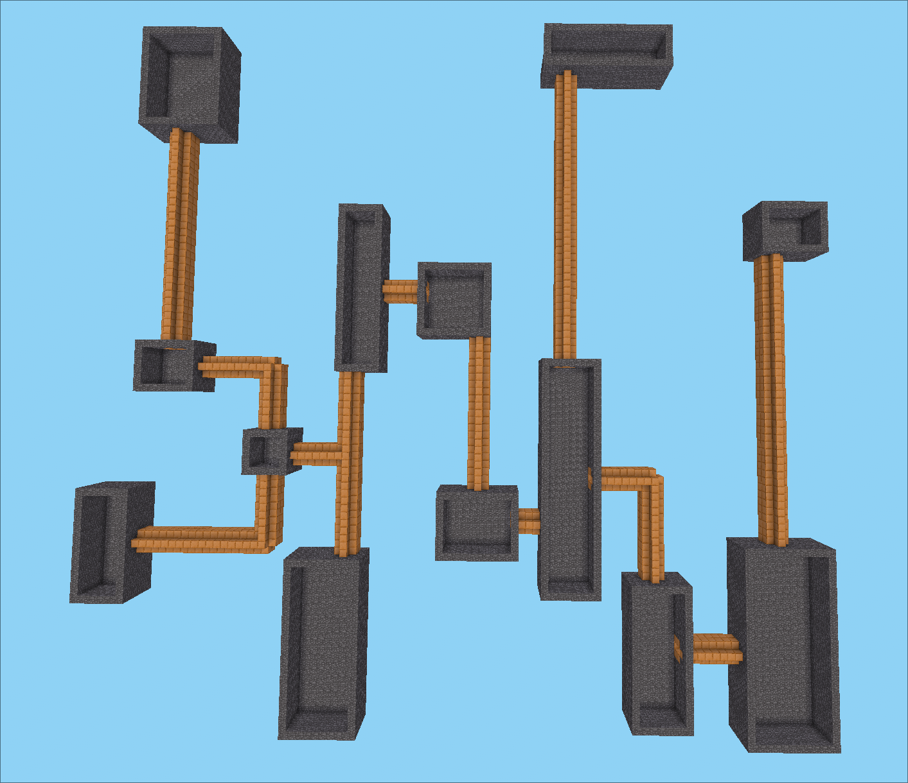
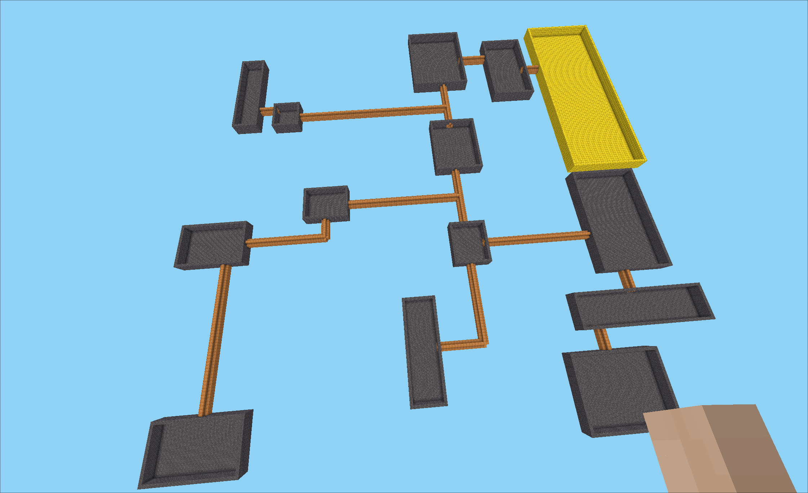
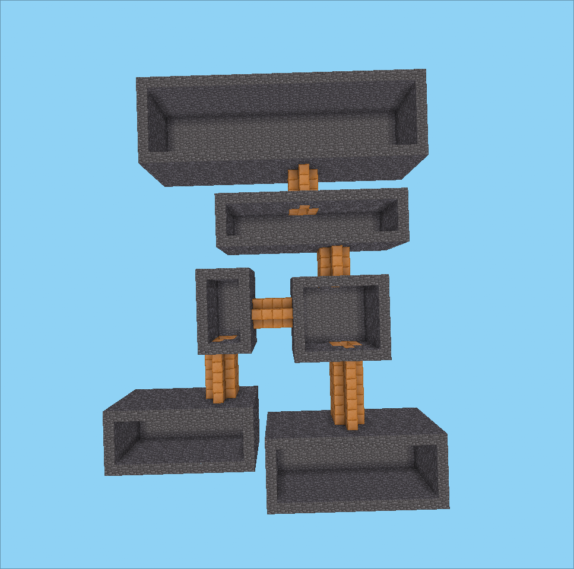

# Open Endedness Environment 1 (OE1)

## General overview

The environment generates a dungeon full of rooms and corridors and the player spawns in one of those rooms. The main (and unique) task is to reach a gold block that is located in the other end of the dungeon. When generating the dungeon we have multiple hyperparameters we can tweak in order to change the shape of the dungeon, the rooms and the corridors

* `dungeon_size`:
* `subdungeon_max_m2`:
* `subdungeon_min_room_length`:
* `subdungeon_full_room_prob`:

The `Dungeon` api provides multiples methods to generate this dungeon

### `dungeon.lua`

A dungeon is represented as a binary tree, each node is considered a subdungeon, which is a subregion of the dungeon.

List of methods

* `Dungeon:new(sb)`: Creates a new instance of the dungeon class. Must recive a subdungeon instance.

* `Dungeon:__tostring()`: Returns an ASCII representation of the dungeon. WIP

* `Dungeon:connect_two_subdungeon(subdungeon1, subdungeon2)`: Given two subdungeon that are adjacent connect them with a corridor. This corridor can be straight or L-shaped. The corridor can connect to a room or another corridor

* `Dungeon:build_dungeon(subdungeon)`: Given a subdungeon (BS Tree) transverse it building corridors and rooms.

* `Dungeon:generate()`: This is the main callback when building a dungeon. It calls the split method, and the build corridor and rooms

---

### `subdungeon.lua`

A subdungeon represents a node in the binary tree. It is a subregion of the main dungeon. Each subregion can have other subregions as children.

List of methods

* `Subdungeon:new(data)`: creates a new instance of the subdungeon class. Data must be `width`, `heigth` and a vector type instance, it will mark the origin point.

* `Subdungeon:split_subdungeon()`: Recursive function that splits the space until the max_m2 condition is met. This is the main function to split the main dungeon area. We call `split_subdungeon()` method for each child it splits.

* `Subdungeon:create_room()`: Creates a room in the subdungeon caller. The room must meet a requirements in order to be created. The room must be created so we need ensure that the subdungeon caller has enough space to fit a room. There is also a small probability to a room to be full size. This means the room will fit all the space available. Nodes are goldblocks for debugging reasons. Finally, the created room is inserted in all `rooms` tables of all the current and parents subdungeon. This involves that the leaf subdungeons `rooms` table only have one room and the parents have multiples rooms.

* `Subdungeon:get_room_middle_point()`: Selects a random room from the `rooms` list and returns it's middle point.

* `Subdungeon:get_middle_point()`: Returns the subdungeon middle point.

* `Subdungeon:is_valid()`: Checks that the subdungeon has valid lenght. It also check if the aspect ratio is correct (WIP).

* `Subdungeon:is_inside(point)`: Checks if a point is inside the boundaries of the subdungeon caller

* `Subdungeon:is_inside_room(point)`: Checks if the point is inside whatever room of the subdungeon caller.

* `Subdungeon:__tostring()`: Returns a string with useful data about the subdungeon. Debugging purpouses

* `Subdungeon:insert(subdungeon1, subdungeon2)`: Insert the two given subdungeons as children in the binary tree. The caller subdungeon is the parent.

---

### `utils.lua`

Set of random functions I did (do) not know where to place them

* `Utils.pseudo_normal_random(min, max)`: Returns a pseudo random number, it samples 6 random numbers and then calculates the mean. This method is used when splitting subdungeon space. We want the cuts to be close to the middle and not have very small areas.

* `Utils.is_room_corner(point, room)`: Returns boolean indicating if the point is part of the rooms corners.

* `Utils.is_room_border(point, room)`: Returns boolean indicating if the point is part of the rooms borders.

When dealing with the corridors placement algorithm, one of my first attempts was to try a a* algorithm to search the shortest path between two rooms. This a* path was going to be build with a lot of corners and will also dodge existing corridors. However, I could not make it work so the code left here are just ruins of a superior civilization that once outperformed our machines.

* `Utils.manhattan_distance(origin, dest)`: Luanti's vectors api measure distance as the euclidean distance. The manhattan distance (or taxi) has been implemented to be used as the heuristic function.

* `Utils.contains(list, element)`: Checks if the element exits in the list and returns it's position. If no element is found a `nil` value is returned.

* `Utils.exits_shorter_path(list, new_element)`: Checks that in the open_list the node already exists and returns true if it is a shorter path

* `Utils.reconstruct_path(dest)`: Given the destination node, it reconstruct the path found by the a* algorithm

* `Utils.a_star(origin, dest)`: Finds the shortest path using the a* algorithm. If path is found returns the list of nodes that forms the path. If not returns an empty table.

---

## Functionality

The dungeon spawn takes place in the `core.register_on_newplayer` function.

```lua
    math.randomseed(os.time() * 22)
	d = Dungeon:new( Subdungeon:new({100, 100 , vector.new(0, 0, 0)}) )
	d:generate()
```

We create a new dungeon object and then use the `generate` callback to fill the space.

## More functionality

...

## What's missing?

[ ] Different shape rooms

[ ] More squared rooms

[ ] Different width corridors

[ ] Add more corridors when dungeon building is finished. This way the final dungeon would be more "laberynthic". This can be also controlled with an hyperparameter

[ ] Create performance test to compare speed of the dungeon builder

## Images

```conf
dungeon_size = 100
subdungeon_max_m2 = 1000
subdungeon_min_room_length = 5
subdungeon_full_room_prob = 0.01
```

Medium size dungeon with long corridors



---

```conf
dungeon_size = 400
subdungeon_max_m2 = 500
subdungeon_min_room_length = 5
subdungeon_full_room_prob = 0.01
```

Big sized dungeon with very big rooms. However this rooms are quite separated from each other. There are a few corridors and they are very long.


---

```conf
dungeon_size = 200
subdungeon_max_m2 = 4000
subdungeon_min_room_length = 10
subdungeon_full_room_prob = 0.1
```



---

Small size dungeon with only 6 small size rooms. Despite 10% of probability, no `full_size` room has spawned. Corridors are short since the rooms are really close from each other. No L-shaped corridors has been spawned

```conf
dungeon_size = 40
subdungeon_max_m2 = 400
subdungeon_min_room_length = 4
subdungeon_full_room_prob = 0.1
```



---

```conf
dungeon_size = 2000
subdungeon_max_m2 = 400
subdungeon_min_room_length = 4
subdungeon_full_room_prob = 0.1
```

> **"The dungeon stretches beyond my sight."**

Ultimate dungeon task. Just try to complete all the task!


